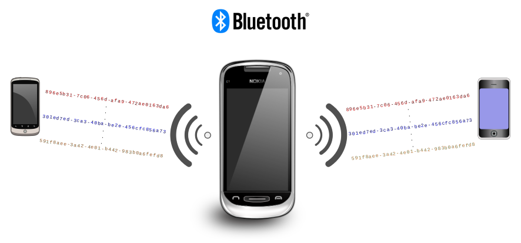
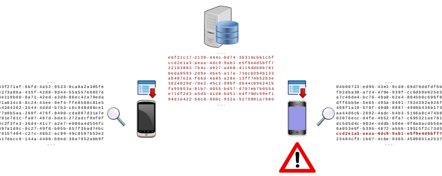
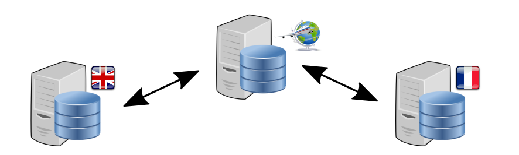

CX: Privacy-compatible distributed contact tracing
==================================================

Download the full [architecture
specification](https://github.com/ipxe/cx/releases/latest/download/cx.pdf)

Overview
--------

CX is an architecture for privacy-compatible distributed contact
tracing, designed for use in pandemics such as Covid-19. It operates
using a model of proximity-based contact detection over one or more
local area broadcast media such as Bluetooth Low Energy (BLE).
Pseudorandom contact identifiers are broadcast and recorded by all
participating devices. A sequence of previously broadcast contact
identifiers may be retroactively associated with a hazard (such as a
positive Covid-19 diagnosis), and the sequence then made available to
all other participating devices.

The architecture provides the following features:

  - **Zero information leakage**: for users who do not choose to
    disclose any information for contact tracing (e.g. because they are
    never diagnosed with the disease), the information broadcast by that
    user is indistinguishable from an ideal random bitstring.

  - **Zero collection of location information**: the devices running the
    protocol can choose to do so with no source of location information,
    and can therefore guarantee that no location history is collected.

  - **Zero privilege**: there is no third party, central authority, or
    software provider who has privileged access to any data.

  - **Trusted diagnoses**: governments and public health services
    provide trusted and digitally signed medical diagnoses, with the
    ability for users to distinguish between self-reported symptoms and
    medical test results.

  - **Distributed contact identification**: users can identify only
    their own hazardous contacts, and no central authority has access to
    the information required to identify contacts.

  - **Immediate deployability**: the protocol may be implemented as an
    app on existing Android and iOS devices, with no requirement for
    changes to the core operating system.

  - **Interoperability**: the protocol may be implemented by any device
    and as part of any app, with all apps and all devices able to
    benefit equally from the same distributed data set.

  - **Flexibility**: multiple interoperating apps may exist to cover
    different user niches and preferences, with no restriction on
    development of new apps and no need for users to be running the same
    app.

  - **International**: the protocol allows for multiple healthcare
    providers in multiple jurisdictions, with support for distributed
    contact identification even for users travelling across national
    boundaries.

  - **Low bandwidth**: the protocol includes measures to reduce the
    bandwidth requirements to manageable levels even when dealing with
    billions of users and frequent requests.

  - **Disconnected operation**: the protocol will operate without a data
    connection, including in environments such as underground, at sea,
    or within an aircraft.

  - **Low resource**: the protocol may be implemented on embedded
    systems such as an ESP32 microcontroller, enabling it to be deployed
    even in environments where typical Android or iPhone mobile devices
    are unaffordable.

  - **Ease of implementation**: all cryptographic operations and data
    formats are chosen to be easily implemented using widely available
    and well-trusted existing libraries.

Each participating device broadcasts a regular stream of messages. Each
message contains a temporary unique **contact identifier**, which is a
random string of numbers and letters such as
`896e5b31-7c06-456d-afa9-472ae0163da6`.

Other devices that are nearby can observe the temporary unique contact
identifier and can record it for future reference. The other devices do
not receive any other information besides the contact identifier.

From the perspective of an observer, the contact identifier is
completely meaningless: it is indistinguishable from random noise. The
observer cannot use the contact identifier to deduce any information
about the identity of the device.

The contact identifier changes frequently, making it impossible for
unwanted observers (such as a stalker, or the owner of a shopping mall,
or a government agency) to use it to track the device.

Each participating device also listens for messages broadcast by other
nearby devices, and keeps a record of all the contact identifiers that
it observes in these messages.

The contact identifiers are meaningless at the time they are observed.
The only thing that the device can do is to record them for future
reference.

The list of recorded contact identifiers is stored on the device and
will never be shared with anyone.

The device may choose to record extra information, such as when or where
the contact identifier was observed. This extra information is also
stored on the device and will never be shared with anyone.

If the device owner becomes infected, the healthcare provider generates
a **confirmation code** and communicates this confirmation code to the
device owner. The device owner enters the confirmation code into the
device.

The healthcare provider can choose how to communicate the confirmation
code to the device owner. Some healthcare providers will find it easiest
to simply read the number out in person. Other healthcare providers may
choose to send confirmation codes via SMS messages, or through an
existing online system.

The confirmation code allows the device to upload a list of the contact
identifiers that it has broadcast over the past week. The list is
uploaded to the healthcare provider’s servers.

To save bandwidth, the device uploads only a single piece of information
(a secret **seed value**) that it had used to generate its sequence of
apparently random contact identifiers. This reduces the bandwidth
required by around 99.9% compared to uploading the complete list.

The device owner makes a deliberate choice to upload the seed value in
order to help alert other people. There is no way for anyone else to
find out the seed value unless the device owner chooses to do this.

The seed value is the only piece of information that is uploaded. The
healthcare provider has no way to know where the device owner has been
or who the device owner has contacted.

The healthcare provider publishes a **notification** list of hazardous
seed values corresponding to positive diagnoses. Each participating
device downloads this list and compares the hazardous contact
identifiers against its own record of observed contact identifiers.

If an observer device finds a match, then it knows that it has recently
been in close proximity to someone who has now been diagnosed and can
raise an alert. The owner of the observer device can choose to take an
appropriate action such as self-isolating.

The observer device can use any private information that it recorded at
the time of observation to help assess the risk level. For example: if
the observer device owner chose to record the time and location where
the contact identifier was observed, then this could be used to
determine that the contact took place while the owner was driving alone
to work and so represents a harmless contact with another driver on the
road.

The owner of a device has complete control over all the information
associated with the contact. There is no way for anyone else to find out
when or where a contact took place.

A healthcare provider can provide guidance or tools to assist in
estimating the levels of risk and in suggesting the actions that should
be taken by affected device owners.

The volume of notifications is potentially very large. There are several
mechanisms in place to minimise the amount of data that each device
needs to download, but it is fundamentally implausible for every device
to be aware of every notification in the world.

Most people do not travel internationally on a frequent basis. Most
notifications are therefore not relevant to most people.

Healthcare providers publish a comprehensive list of notifications that
are relevant to people within their geographical **subscription zone**.
For a national healthcare provider, this subscription zone is the whole
country.

Everyone subscribes by default to receive notifications from the
subscription zone of their own country.

People who travel internationally can choose to also receive
notifications from the subscription zones of any country through which
they have recently travelled. Devices may choose to manage these
subscriptions automatically for convenience.

People who are diagnosed after recent international travel can inform
the healthcare provider. The healthcare provider then publishes the
notification for that diagnosis to a special worldwide subscription
zone. Other healthcare providers see this and include that notification
within the comprehensive list that they publish for their own
subscription zone.

The volume of notifications for people who have been diagnosed shortly
after international travel is relatively small, and so does not result
in excessive amounts of data to be downloaded.

For healthcare providers in very large geographic areas, this same
hierarchical approach can be used to break down subscription zones to
state or county levels.

This is an **open standard**. Any healthcare provider or app developer
can deploy this technology. There are no licensing fees, patents, or
other intellectual property barriers.

Any app will work with any healthcare provider. There is no need for
each healthcare provider to create a dedicated app, although many
healthcare providers may choose to do so. Users can choose the app that
best fits their individual needs: for example, a niche app could be
developed with a user interface designed for a particular visual
impairment.

Healthcare providers can work independently or can choose to share
notifications with selected other healthcare providers in order to
maximise the worldwide effectiveness of contact tracing.

Details
-------

For more information, see the [architecture
specification](https://github.com/ipxe/cx/releases/latest/download/cx.pdf)

